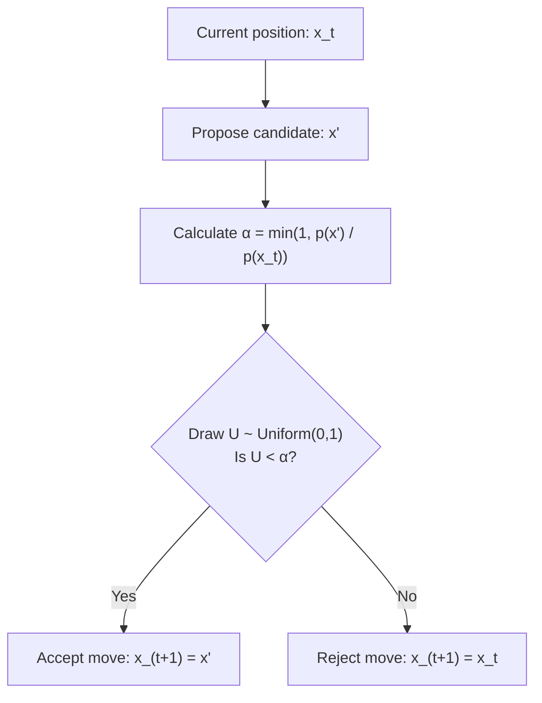

In [Part 1 of our sampling series](), we built a complete pipeline from raw deterministic silicon to probability distributions. We saw that if you have a uniform random number $U \sim \mathcal{U}(0,1)$, you can pass it through an inverse cumulative distribution function $X = F^{-1}(U)$ to get a sample from your target distribution. When direct inversion gets tricky, rejection sampling lets you generate points under an easy curve and filter out the excess height.

That pipeline works beautifully as long as you can evaluate the full distribution and invert its CDF. But in the real world—especially in Bayesian statistics—we constantly run into a far more stubborn problem. 

What happens when you have a function that tells you how probable a state is, but you have no way to sample from it directly?

## The Bayesian Trap: Intractable Normalizing Constants

To see why this happens, look at the foundation of Bayesian inference:

$$
p(\theta \mid y) = \frac{p(y \mid \theta) p(\theta)}{p(y)}
$$

We want to sample parameters $\theta$ given some observed data $y$. The numerator is straightforward: $p(y \mid \theta)$ is the likelihood of our data, and $p(\theta)$ is our prior belief. We can evaluate both easily for any specific choice of $\theta$.

The trouble lives in the denominator. The marginal likelihood $p(y)$, also known as the evidence, requires integrating over every possible value of $\theta$:

$$
p(y) = \int p(y \mid \theta) p(\theta) \, \mathrm{d}\theta
$$

In high-dimensional spaces, evaluating this integral analytically is completely impossible. We are left with a proportional relationship:

$$
p(\theta \mid y) \propto p(y \mid \theta) p(\theta)
$$

We can evaluate the relative height of the target distribution at any coordinate, but we do not know the normalizing constant that makes the total area under the curve integrate to 1. Without that constant, the CDF $F(\theta)$ is unavailable, rendering inverse transform sampling completely useless.

This forces us to ask a radically different question: **can we generate valid samples from a probability distribution if all we can do is evaluate its unnormalized height?**

## First Fallback: Rejection Sampling

Part 1 flagged rejection sampling as the natural next tool once inversion fails, so let's see how far it actually gets us. The recipe is simple: pick an easy-to-sample proposal (or "envelope") distribution $q(x)$, scale it by a constant $M$ large enough that it sits above the target everywhere, $p(x) \leq M q(x)$, and then play a filtering game:

1. Draw a candidate $x$ from the easy distribution $q(x)$.
2. Draw a uniform random number $U \sim \mathcal{U}(0,1)$.
3. Accept $x$ if $U < \dfrac{p(x)}{M q(x)}$. Otherwise, reject it and draw another candidate.

Geometrically, you're scattering points uniformly under the curve $Mq(x)$ and keeping only the ones that also fall under $p(x)$. What survives that filter is, by construction, distributed exactly like $p(x)$ — and this still works when $p(x)$ is only known up to a constant, since that missing constant just gets folded into $M$.

So why not reach for this every time inversion fails? Two problems compound quickly:

* **You need to already know the shape you're trying to sample.** Choosing a valid $M$ means bounding $p(x)$ everywhere, including in tails you haven't explored yet. For a black-box density, nobody hands you that bound for free.
* **Acceptance collapses as dimensionality grows.** The acceptance rate is roughly the ratio of the volume under $p(x)$ to the volume under $Mq(x)$. Even a modest number of dimensions can shrink that ratio so far that you throw away nearly every candidate you draw.

Rejection sampling, in other words, still asks you to out-guess the target distribution before you've sampled it. What we actually want is a method that learns the shape of $p(x)$ as it explores — spending its time automatically where the density is high, with no envelope to design at all.

## Constructing an Ugly Distribution

To visualize this challenge, imagine you are handed a bumpy bimodal target distribution made of two separated Gaussians:

$$
p(x) = 0.3 \, \mathcal{N}(-2, 0.5^2) + 0.7 \, \mathcal{N}(2, 1^2)
$$

| Region | Left Peak | Saddle / Valley | Right Peak |
| :--- | :--- | :--- | :--- |
| **Location ($x$)** | $x = -2.0$ | $x = 0.0$ | $x = 2.0$ |
| **Relative Density $p(x)$** | Moderate Peak | Very Low Density | High Peak |

Imagine you do not know this comes from two Gaussians. All you possess is a black-box function `unnormalized_density(x)` that returns a single height number for any $x$ you pass in. You cannot invert it, and you cannot easily bound it with an envelope for rejection sampling.

If you cannot draw samples directly, what if you built an exploratory walk that naturally spends more time in high-density regions?

## Step 1: The Dumb Random Walk

Let's start with the simplest exploratory process you could possibly code: a blind random walk. Pick a starting point $x_0$, and at each step, propose a new position by adding a bit of Gaussian noise:

$$
x_{t+1} = x_t + \epsilon, \qquad \epsilon \sim \mathcal{N}(0, \sigma^2)
$$

If you run this process for 10,000 steps and plot a histogram of where the walker traveled, you will get a scattered mess that depends entirely on where you started and how long you ran the code. 

The walker wanders around, but it has no awareness of $p(x)$. It treats low-probability valleys and high-probability peaks with identical curiosity. To turn this random walk into a valid sampler, we need a mechanism that biases the walker toward regions where $p(x)$ is large.

## Step 2: The Metropolis Algorithm

In 1953, Nicholas Metropolis and his collaborators introduced an ingenious rule: accept every proposed move that goes uphill, but occasionally accept moves that go downhill.

The algorithm proceeds as follows:

1. Start at a current state $x_t$.
2. Propose a candidate state $x'$ using a symmetric proposal step $x' \sim \mathcal{N}(x_t, \sigma^2)$.
3. Calculate the acceptance ratio:

$$
\alpha = \min\left(1, \frac{p(x')}{p(x_t)}\right)
$$

4. Draw a uniform random number $U \sim \mathcal{U}(0,1)$. If $U < \alpha$, accept the proposal and set $x_{t+1} = x'$. Otherwise, reject the proposal and stay put: $x_{t+1} = x_t$.



The crucial intuition lies in how downhill moves are handled. If a proposed point $x'$ has lower probability than $x_t$, we do not automatically reject it. We accept it with probability $\alpha = \frac{p(x')}{p(x_t)}$.

That downhill tolerance is deliberate. If your algorithm only accepted uphill moves, it would turn into an optimization routine. It would climb to the nearest local peak, get stuck there forever, and mistake a single mode for the entire probability distribution. The occasional downhill step is what allows the chain to descend into valleys, cross low-density regions, and discover other peaks across the landscape.

If you let this Metropolis chain step around for enough iterations, the histogram of its path converges to match $p(x)$ with remarkable precision. Here it is on our bimodal target from earlier — no CDF, no envelope, just the accept/reject rule:

```python
import numpy as np

def unnormalized_density(x):
    left = 0.3 * np.exp(-0.5 * ((x + 2) / 0.5) ** 2)
    right = 0.7 * np.exp(-0.5 * ((x - 2) / 1.0) ** 2)
    return left + right

def metropolis(n_steps, x0=0.0, sigma=1.0, seed=0):
    rng = np.random.default_rng(seed)
    x = x0
    samples = np.empty(n_steps)
    for t in range(n_steps):
        proposal = x + rng.normal(0.0, sigma)
        alpha = min(1.0, unnormalized_density(proposal) / unnormalized_density(x))
        if rng.random() < alpha:
            x = proposal
        samples[t] = x
    return samples

samples = metropolis(n_steps=10_000)
# A histogram of `samples` recovers the 0.3 / 0.7 split between the two
# peaks, even though unnormalized_density() was never normalized and its
# CDF was never written down.
```

Notice everything this chain *didn't* need: no inverse CDF, no envelope $q(x)$, no bound $M$. It only ever compares $p(x)$ at two points, which is exactly why it survives contact with an unnormalized posterior.

## Why Does Metropolis Work? (Detailed Balance)

The reason this simple game produces valid samples comes down to a property called **detailed balance**.

Because our proposal step is symmetric, the probability of proposing a move from $x$ to $x'$ is identical to proposing a move from $x'$ back to $x$: $q(x' \mid x) = q(x \mid x')$. Combined with our acceptance rule, the transition probabilities satisfy a strict equilibrium condition:

$$
p(x) P(x \rightarrow x') = p(x') P(x' \rightarrow x)
$$

This equation states that in long-run equilibrium, the rate of probability flowing from state $x$ to state $x'$ exactly balances the probability flowing from $x'$ back to $x$. 

You do not need a dense theoretical treatise on Markov chains to appreciate the core consequence: **the target distribution $p(x)$ becomes the unique stationary distribution of the process.**

This yields the central philosophy of Markov Chain Monte Carlo:

$$
\boxed{
\text{Don't sample from } p(x) \text{ directly. Build a process whose stationary distribution is } p(x).
}
$$

## Metropolis-Hastings and the Bayesian Payoff

In 1970, W.K. Hastings generalized the Metropolis algorithm to handle asymmetric proposal distributions $q(x' \mid x)$, where proposing a step from $x$ to $x'$ might be easier than proposing the return trip.

Adjusting the acceptance ratio to account for this asymmetry yields the **Metropolis-Hastings** acceptance probability:

$$
\alpha = \min\left(1, \frac{p(x') q(x_t \mid x')}{p(x_t) q(x' \mid x_t)}\right)
$$

Now, observe what happens when we plug our unnormalized Bayesian posterior into this ratio:

$$
\frac{p(\theta' \mid y)}{p(\theta_t \mid y)} = \frac{\left( \frac{p(y \mid \theta') p(\theta')}{p(y)} \right)}{\left( \frac{p(y \mid \theta_t) p(\theta_t)}{p(y)} \right)} = \frac{p(y \mid \theta') p(\theta')}{p(y \mid \theta_t) p(\theta_t)}
$$

Look at that cancellation: **the intractable evidence term $p(y)$ completely disappears.**

Because Metropolis-Hastings depends exclusively on the ratio of probabilities between two points, the unknown normalizing constant cancels out entirely. We can sample complex Bayesian posteriors without ever computing the impossible denominator integral.

## Gibbs Sampling: Dividing Multi-Dimensional Problems

When moving to high-dimensional spaces $\mathbf{x} = (x_1, x_2, \ldots, x_d)$, proposing random moves for every variable simultaneously leads to low acceptance rates.

**Gibbs sampling** simplifies this by updating one variable at a time, conditioned on the current values of all other variables:

1. Sample $x_1^{(t+1)} \sim p(x_1 \mid x_2^{(t)}, x_3^{(t)}, \ldots, x_d^{(t)})$
2. Sample $x_2^{(t+1)} \sim p(x_2 \mid x_1^{(t+1)}, x_3^{(t)}, \ldots, x_d^{(t)})$
3. Repeat for all $d$ dimensions.

The neat feature of Gibbs sampling is that every single conditional proposal is automatically accepted: $\alpha = 1$. By breaking a joint distribution down into a series of one-dimensional updates, you eliminate rejected proposals entirely.

However, Gibbs sampling hits a severe bottleneck when variables are strongly correlated. If $x_1$ and $x_2$ form a tight diagonal ridge, updating along individual coordinate axes forces the sampler to take tiny zig-zag steps, causing exploration to crawl to a near standstill.

## The Random Walk Bottleneck

While Metropolis-Hastings and Gibbs sampling solve the conceptual challenge of sampling without a normalizing constant, simple random-walk proposals scale poorly to high dimensions.

| Problem | Cause | Practical Impact |
| :--- | :--- | :--- |
| **High Rejections** | Large step size $\sigma$ | Proposals land in low-probability regions and get rejected. |
| **Slow Diffusion** | Small step size $\sigma$ | Chain accepts moves, but explores via slow random walks. |
| **Correlation** | Off-diagonal covariance | Sampler gets stuck taking micro-steps along narrow ridges. |

Random walks suffer from the fundamental physics of diffusion: to cover a distance $D$, a random walk requires roughly $D^2$ steps. In a 500-dimensional space, blind random walks waste almost all their time rejecting proposals or taking tiny steps in circles.

To scale up, we need samplers that use the geometry of the target space to guide their steps.

## Gradient-Based Sampling: From Langevin Dynamics to MALA

Instead of proposing moves blindly, we can compute the gradient of the log-density: $\nabla_x \log p(x)$. This vector points directly in the direction where probability density increases.

Using this geometric signal gives us **Unadjusted Langevin Algorithm (ULA)** steps:

$$
x_{t+1} = x_t + \frac{\epsilon^2}{2} \nabla_x \log p(x_t) + \epsilon \mathbf{z}, \qquad \mathbf{z} \sim \mathcal{N}(\mathbf{0}, \mathbf{I})
$$

This equation combines a deterministic nudge uphill along the gradient with a controlled injection of random noise $\mathbf{z}$. 

Because discrete step sizes introduce integration drift, we combine this update with a Metropolis accept/reject check. This combination is called the **Metropolis-Adjusted Langevin Algorithm (MALA)**. By using gradients, MALA proposes moves that actively follow the contours of the target distribution, yielding far higher acceptance rates over larger distances.

## Hamiltonian Monte Carlo (HMC): Turning Probability Into Physics

If MALA is like walking uphill with a compass, **Hamiltonian Monte Carlo (HMC)** is like turning the probability landscape into a frictionless skate park.

Instead of treating $x$ as a point floating in space, HMC imagines $x$ as the position of a physical particle sliding over a surface. We introduce an auxiliary momentum vector $\mathbf{p} \sim \mathcal{N}(\mathbf{0}, \mathbf{M})$ and define a physical system with total energy $H(\mathbf{x}, \mathbf{p})$:

$$
H(\mathbf{x}, \mathbf{p}) = \underbrace{-\log p(\mathbf{x})}_{\text{Potential Energy } U(\mathbf{x})} + \underbrace{\frac{1}{2} \mathbf{p}^\top \mathbf{M}^{-1} \mathbf{p}}_{\text{Kinetic Energy } K(\mathbf{p})}
$$

High-density regions in $p(\mathbf{x})$ act as deep gravity wells (low potential energy), while low-density regions act as steep hills (high potential energy). 

To propose a new state, HMC hands the particle a random momentum kick $\mathbf{p}$ and simulates its trajectory over continuous time using Hamilton's equations:

$$
\frac{\mathrm{d}\mathbf{x}}{\mathrm{d}t} = \frac{\partial H}{\partial \mathbf{p}}, \qquad \frac{\mathrm{d}\mathbf{p}}{\mathrm{d}t} = -\frac{\partial H}{\partial \mathbf{x}}
$$




Using a numerical integration scheme called the leapfrog integrator, the particle glides across the landscape, converting potential energy into kinetic energy as it sweeps through high-density zones, before climbing up the far side of the well.

Because physical systems conserve total energy $H(\mathbf{x}, \mathbf{p})$, the proposed destination point along this trajectory maintains a near-100% acceptance probability—even over large distances in high-dimensional spaces. 

While random-walk MCMC stumbles around blindly, Hamiltonian Monte Carlo uses physics and gradients to trace trajectories through complex target distributions.

## Practical Limitations of MCMC

Despite their power, MCMC algorithms are not silver bullets. Working with MCMC requires managing several practical constraints:

* **Burn-in / Warm-up:** The chain begins at an arbitrary starting point $x_0$. Early samples reflect this arbitrary initial position rather than the target distribution, and must be discarded.
* **Autocorrelation:** Consecutive samples $x_t$ and $x_{t+1}$ drawn from a chain are structurally correlated, violating the assumption of independent and identically distributed draws.
* **Mixing Speed:** If a target distribution contains isolated modes separated by deep regions of near-zero density, MCMC chains can get trapped in a single mode for thousands of iterations.
* **Effective Sample Size (ESS):** A chain of 100,000 correlated MCMC steps might contain the same statistical information as only 1,000 independent samples.

## Looking Ahead

We have built an arsenal of tools for generating samples. In Part 1, we inverted simple CDFs. In Part 2, we tried an envelope first, then constructed Markov chains that converge to complex, unnormalized target distributions.

A pile of samples, on its own, is not obviously useful — it's just numbers in a vector. **Part 3** asks what all this trouble was actually for: it turns out drawing samples lets us compute high-dimensional integrals, estimate expectations, and solve problems that would otherwise be computationally intractable.
